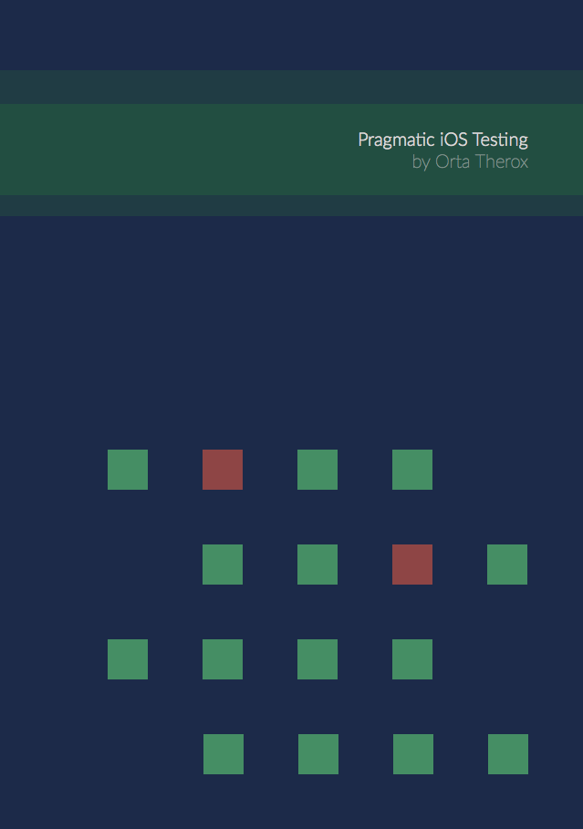

A Pragmatic Approach to iOS Testing
===============

An ebook about pragmatic testing strategies. Click below to get the latest epub.

##### Prospective Pages

* What & Why of the book
* What is XCTest, how does it work?
* How can I be pragmatic with my testing?

* Types of Testing
  * Unit Testing
  * Behaviour Testing
  * Integration Testing

* Useful terminology
  * Testing Terminology
	* DI
	* Stubs / Mocks
	* Fakes ( + protocols )

* Tooling for the types of testing
  * Unit Testing ( Specta / Expecta Quick / Nimble )
     * Three types of unit tests
  * Mocking / Stubbing ( OCMock / OCMockito )
	* Network Stubbing ( OHTTP / VCRURLConnection )

* Getting Setup
  * Introducing tests into an existing application
  * Starting a new application and using tests
  * My tests are running in my app?
  * Developer Operations aka Automation

* Techniques for keeping testing code sane
  * Nested Before / After usage
  * Creation of app-centric `it` blocks
  * Fixtures / Factories

* Techniques for avoiding Async Testing
  * Networking in View Controllers ( Network Models )
  * Animations
  * Dispatch Asyncs ( ar\_dispatch etc )
  * `will` / `XCTest 6`

* Techniques for testing different aspects of the app
  * Views ( Snapshots )
  * User interactions
  * iPad / iPhone

* Core Data
  * Stubbed Core Data Contexts
  * Testing Migrations

* Testing Common Cocoa Patterns
  * Delegate / Protocols
  * Singletons
  * Notifications
  * KVO
  * Networking
  * MVC

* Making libraries to get annoying tests out of your app
* Using Xcode pragmatically
* Improving Xcode
* Expanding on Specta / Expecta
* Test Driven Development
* Swift
* Recommended
  * Books
  * Websites
  * Twitter Follows

* OSS Testing in iOS
  * RestKit + AFNetworking
  * Moya / Eidolon
* Eigen

##### Existing Pages

| Topics | Last Updated |
| -------|--------------|
|[Core Data_migrations](core_data_migrations.md)|04 Apr|
|[Dependency Injection](dependency_injection.md)|04 Apr|
|[Developer Operations](developer_operations.md)|29 Mar|
|[Getting Setup](getting_setup.md)|04 Apr|
|[How Can_i_be_pragmatic](how_can_i_be_pragmatic.md)|04 Apr|
|[How I_got_started](how_i_got_started.md)|04 Apr|
|[Introducing Tests_into_an_existing_app](introducing_tests_into_an_existing_app.md)|04 Apr|
|[Recommended Websites](recommended_websites.md)|17 Mar|
|[Stubbed Core_data](stubbed_core_data.md)|04 Apr|
|[Techniques For_avoiding_async_testing](Techniques_for_avoiding_Async_Testing.md)|04 Apr|
|[Testing Delegates](testing_delegates.md)|29 Mar|
|[Three Types_of_unit_tests](Three_Types_of_Unit_Tests.md)|04 Apr|
|[Tooling For_different_types_of_testing](Tooling_for_different_types_of_testing.md)|04 Apr|
|[Types Of_testing](types_of_testing.md)|17 Mar|
|[Useful Terminology](useful_terminology.md)|04 Apr|
|[What And_why](what_and_why.md)|11 Sep|
|[What Is_xctest](what_is_xctest.md)|11 Sep|

##### Generating the ebook

The latest epub copy can be generated by running `ruby generate.rb`
